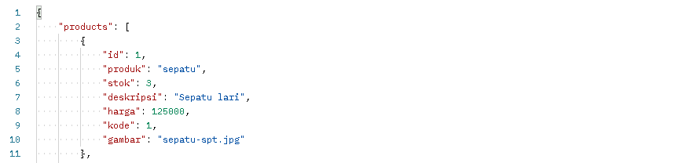

# ALTA-store

## About
ALTA-store is a RESTful API for marketplace. There's 5 major API in this RESTful:
  1. users (login and register users)
  2. products (product in marketplace)
  3. categories (product category)
  4. carts (inserting and deleting products from cart)
  5. transactions (buying and transactions products from cart)
### Built With
  - Go Language
  - Echo framework
  - MySQL Database

## Start
```bash
git clone https://github.com/9tw/ALTA-store.git
```

## Usage

Pengguna login dengan memasukan email dan password yang sudah terdaftar

Keluaran dari proses login berupa data diri dan token JWT

Pengguna dapat melihat kategori yang ada

Keluaran dari proses ini berupa data kategori

Pengguna dapat melihat produk yang ada

Keluaran dari proses ini berupa data produk

## Roadmap
  - Adding status customer and admin to users
  - Deployment to Heroku/AWS/GCP

## Contributing
Pull requests are welcome. Any contributions you make are greatly appreciated.
  1. Fork the project
  2. Create your feature branch (git checkout -b feature/GreatFeature)
  3. Commit your changes (git commit -m "This is GreatFeature")
  4. Push to the branch (git push origin feature/GreatFeature)
  5. Open a pull request

## License


## Contact
Gerdo Trada Wijaya - gerdotradawijaya@gmail.com
Ridho Febriansa -
Project link: https://github.com/9tw/ALTA-store/

## Acknowledgements
  - GORM library
  - JSON Web Tokens
