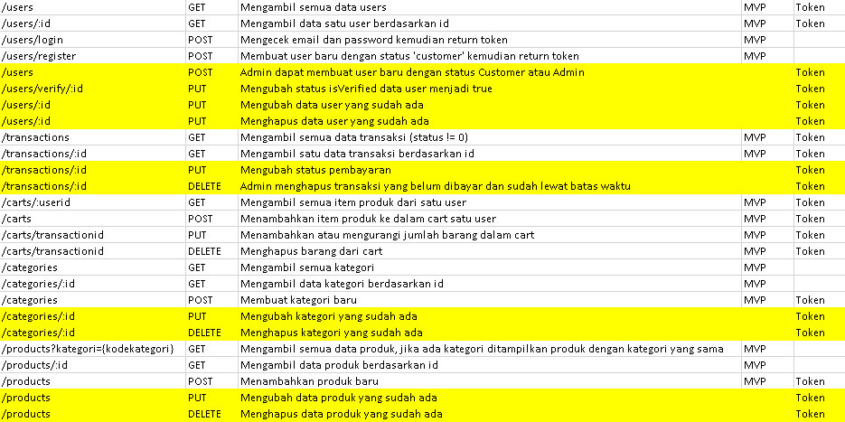

# Design RESTful API

## Navigasi
- [Gambar](#gambar)
- [Penjelasan Tiap Master](#penjelasan-tiap-master)
  - [Users](#users)
  - [Categories](#categories)
  - [Products](#products)
  - [Carts](#carts)
  - [Transactions](#transactions)
- [Parameter](#parameter)
  - [Users](#users)
  - [Categories](#categories)
  - [Products](#products)
  - [Carts](#carts)

## Gambar
RESTful API Design

## Penjelasan Tiap Master
- Users: Pengguna program ini (pelanggan). Terdapat login dan register.
- Categories: Kategori untuk barang.
- Products: Kumpulan barang pada program ini.
- Carts: Pelanggan memasukan barang ke keranjang belanja.
- Transactions: Pelanggan melakukan transaksi pembelian barang.

## Parameter
- Users
  - Login
    - Email
    - Password
  - Register
    - Nama
    - Email
    - Password
    - Token
    - No HP
    - Foto
    - Alamat
- Categories
  - Kode
  - Nama
- Products
  - Nama
  - Stok
  - Deskripsi
  - Harga
  - Categories
- Carts
  - User
  - Product
  - Stock
  - Harga
  - Total
